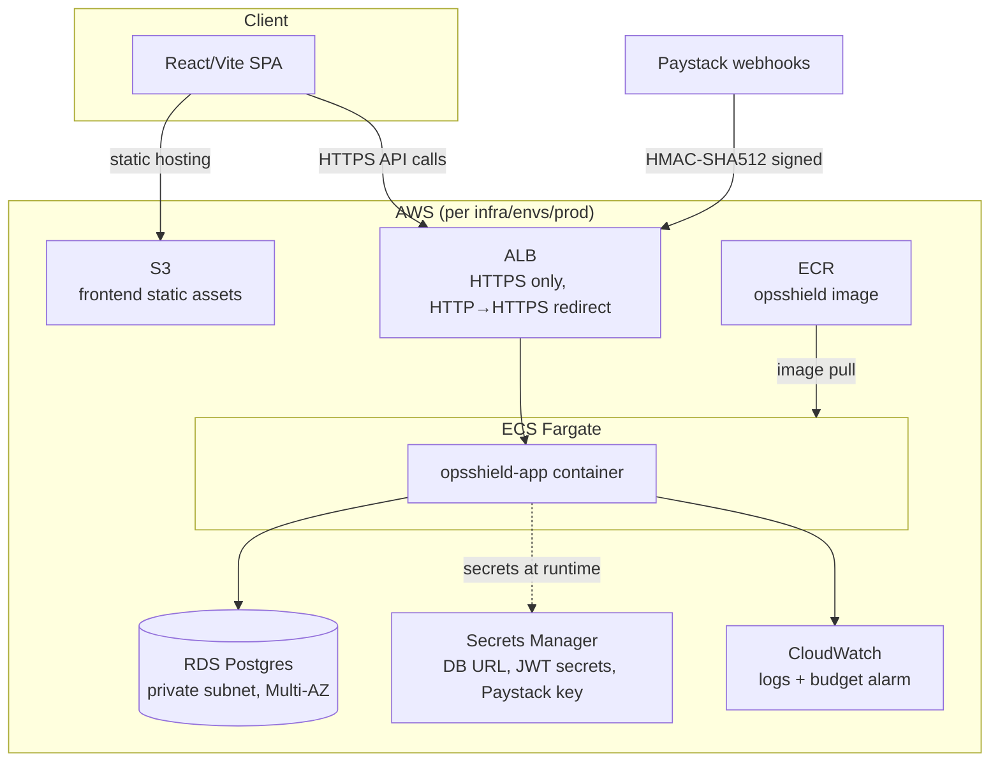
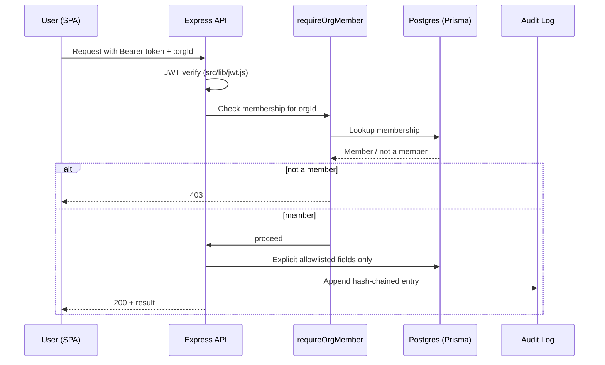
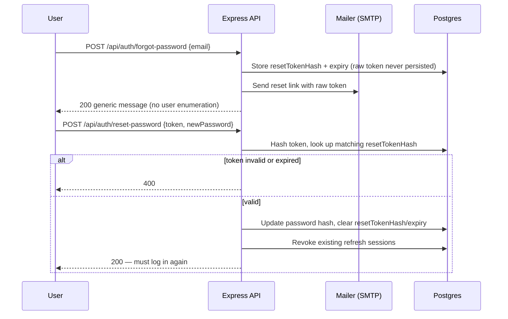
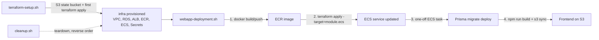

# Architecture

## Overview

OpsShield is a multi-tenant SaaS platform: a Node.js/Express API backed by
Postgres (Prisma), a React/Vite frontend, and AWS infrastructure provisioned
entirely through modular Terraform. Every org-scoped resource is isolated by
`requireOrgMember` middleware, and all state-changing money/security events
(billing, audit log) are handled through dedicated, verified code paths.

## System diagram

## Request flow — authenticated org action

## Password reset flow

## Deployment flow

## Design notes

- **Isolation**: every module in `infra/modules/` maps 1:1 to a security or
  cost boundary (e.g. `rds` is never publicly reachable; `secrets` holds one
  secret per credential rather than a shared blob).
- **No plaintext secrets at rest in the app layer**: ECS task definitions
  reference Secrets Manager ARNs only; JWT secrets are generated inside
  Terraform (`random_bytes`) so they never pass through a `.tfvars` file.
  See `infra/README.md` for the full rationale.
- **CI/CD trust boundary**: GitHub Actions authenticates via OIDC
  (`module.github_oidc`), restricted to `main`-branch workflow runs on this
  repo — no long-lived AWS credentials stored anywhere.
- **Migrations run out-of-band** from app startup, as a one-off Fargate task
  triggered by `webapp-deployment.sh`, so a bad migration can't crash-loop
  the running service.
